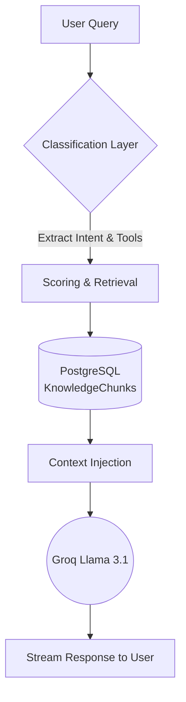
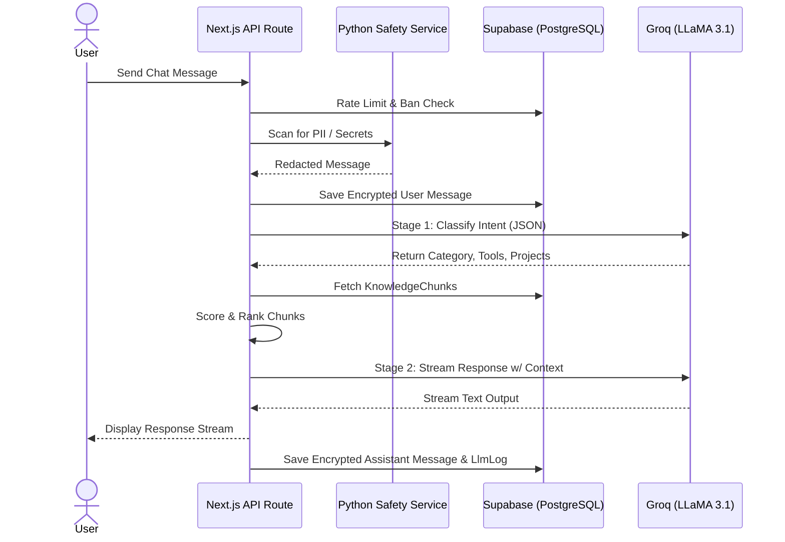
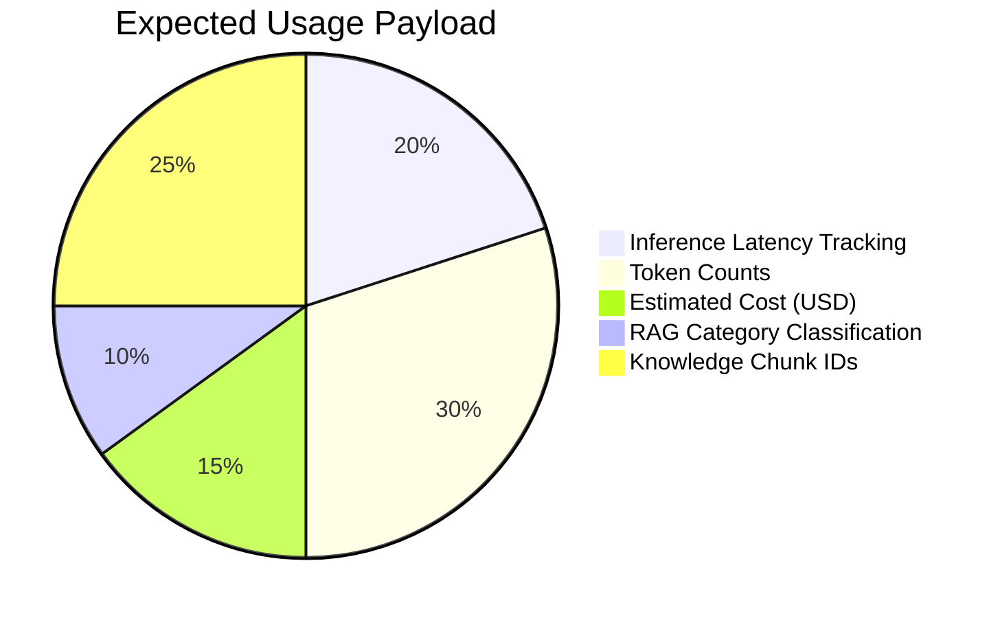
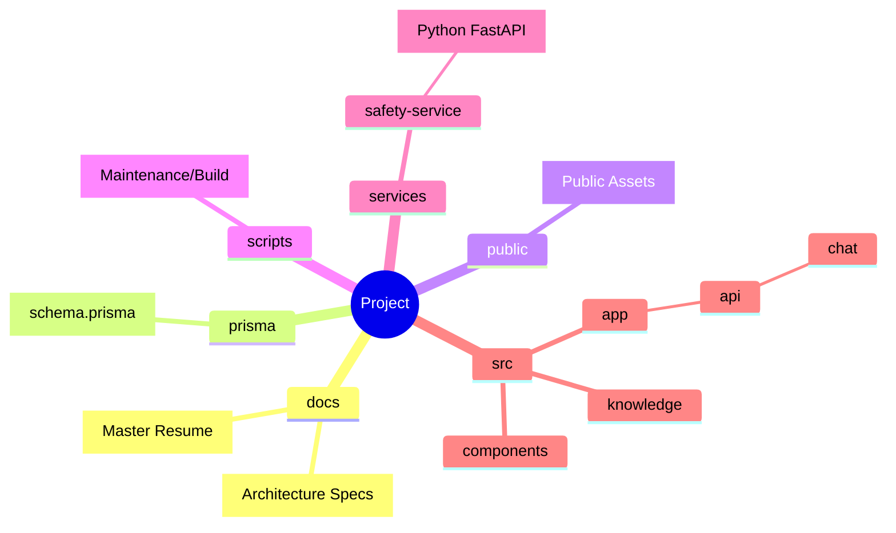

# 🌟 Project Overview: Girwan Dhakal Personal Website

## 📖 Introduction
This repository contains the source code for Girwan Dhakal's interactive personal website and portfolio. Beyond a standard static portfolio, the site features a highly sophisticated **Retrieval-Augmented Generation (RAG) AI Chatbot** embedded within a modal phone UI. The chatbot acts as an interactive resume, answering user queries strictly using grounded data about Girwan's skills, projects, and work experience.

---

## 🏗️ Architecture Stack

The project employs a modern, production-grade architecture split between a TypeScript full-stack frontend/backend and a Python microservice for safety checking.

| Layer | Technology | Description |
| :--- | :--- | :--- |
| **Frontend Framework** | ⚛️ Next.js (App Router), React, TS | Core UI and API routing |
| **Styling & Animations** | 🎨 Tailwind CSS, Framer Motion | Core aesthetics and advanced UI transitions |
| **Database** | 🐘 Supabase (PostgreSQL), Prisma | State management and data storage |
| **LLM Provider** | 🦙 Groq API (`llama-3.1-8b-instant`) | Ultra-fast inference engine |
| **Safety Microservice**| 🐍 Python FastAPI, Presidio | PII and API key scanning |

*Note: Database connections use Supabase's Session Connection Pooler on port `5432` for schema migrations and Transaction Pooler on `6543` for standard queries.*

---

## ⚙️ Core Features

### 1. Two-Stage RAG Pipeline
The chat interface (`src/app/api/chat/route.ts`) implements an advanced classification-based RAG pipeline:



#### Data Flow Visualized


> [!WARNING]
> **Database Synchronization**: The `KnowledgeChunk` database table is **not** updated automatically. If `src/knowledge/data.json` or the master resume is modified, developers must manually run `npm run index:knowledge`. However, the `ChatMessage` table **is** updated automatically in real-time.

### 2. Comprehensive Safety & Security Guardrails

| Feature | Description | Implementation |
| :--- | :--- | :--- |
| **PII Scanning** | Pre-flight checks on user inputs | Python Presidio Microservice (Fallback: TS regex) |
| **Prompt Injection** | Detects jailbreak attempts | Automatic LLM override |
| **Uncertainty Rule** | Prohibits hallucinations | Hardcoded email redirection fallback |
| **Ban Shield** | Tracks violations & rate limits | Hashed device fingerprints & IP hashes |
| **Encrypted Storage**| AES-256-GCM encryption at rest | Client-provided session key |

### 3. Telemetry & Analytics Tracker

Every chat interaction is logged into the `LlmLog` database table.



---

## 📂 Directory Structure



---

## 🚀 Important Commands for Setup & Execution

### 1. Environment Setup
Create a `.env.local` file containing the Supabase database connection strings, EmailJS secrets, and the Groq API key.
> [!TIP]
> Use the Supabase Session Pooler URL (Port 5432) for `DIRECT_URL` and Transaction Pooler (Port 6543 with `?pgbouncer=true&connection_limit=1`) for `DATABASE_URL`.

### 2. Python Microservice
Navigate to `services/safety-service` and start the FastAPI server:
```bash
python -m venv venv
source venv/bin/activate  # On Windows: .\venv\Scripts\activate
pip install -r requirements.txt
uvicorn main:app --reload --port 8000
```

### 3. Database Migration & Prisma Generation
Ensure your Prisma client is synced with the Supabase PostgreSQL instance:
```bash
npx dotenv-cli -e .env.local -- prisma db push
npx prisma generate
```

### 4. Index Knowledge Base
Seed the `KnowledgeChunk` database table with the portfolio data:
```bash
npx dotenv-cli -e .env.local -- npm run index:knowledge
```

### 5. Start Development Server
Run the Next.js frontend and API:
```bash
npm run dev
```
